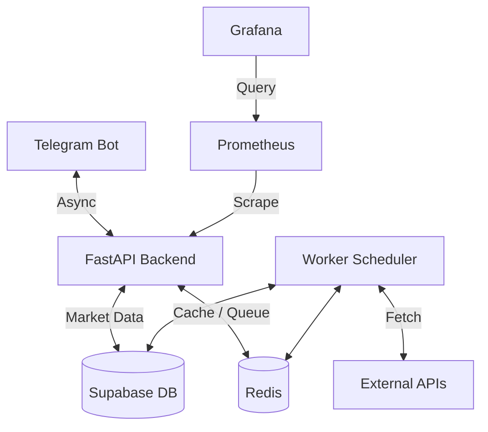

# 🚀 CAIOS: Crypto AI Investment Operating System

CAIOS is an advanced, AI-driven platform for cryptocurrency analysis, signal generation, and portfolio management. Powered by an autonomous AI council, real-time market data, and robust infrastructure.


## 🏛️ Architecture



## 🚀 Quick Start

Ensure you have Docker and Docker Compose installed.

1. Clone the repository
2. Configure environment variables (see below)
3. Run the stack:
   ```bash
   docker-compose up -d --build
   ```
4. Access the API at `http://localhost:8000/docs`
5. Access Grafana at `http://localhost:3000`

## ⚙️ Environment Variables

Create a `.env` file in the root directory:

| Variable | Description | Example |
|----------|-------------|---------|
| `DATABASE_URL` | PostgreSQL connection string | `postgres://user:pass@db:5432/caios` |
| `REDIS_URL` | Redis connection string | `redis://redis:6379/0` |
| `TELEGRAM_BOT_TOKEN` | Token from BotFather | `123456:ABC-DEF1234ghIkl-zyx57W2v1u123ew11` |
| `TELEGRAM_USER_ID` | Admin User ID for access | `987654321` |

## 🔌 API Endpoints (FastAPI)

| Method | Endpoint | Description |
|--------|----------|-------------|
| GET | `/health` | Service healthcheck |
| GET | `/metrics` | Prometheus metrics |
| GET | `/api/v1/signals` | Get latest signals |
| GET | `/api/v1/portfolio` | Get user portfolio |

## 🤖 Telegram Bot Commands

| Command | Description |
|---------|-------------|
| `/start` | Welcome message and menu |
| `/help` | List all commands |
| `/top` | Show top 10 signals right now |
| `/signal <COIN>`| Get signal for specific coin |
| `/agents` | Show AI council status and stats |
| `/portfolio`| User portfolio overview |
| `/subscribe` | Subscribe to signal alerts |
| `/unsubscribe`| Unsubscribe from alerts |
| `/status` | System status |

---
*Built with ❤️ for the future of decentralized finance.*
